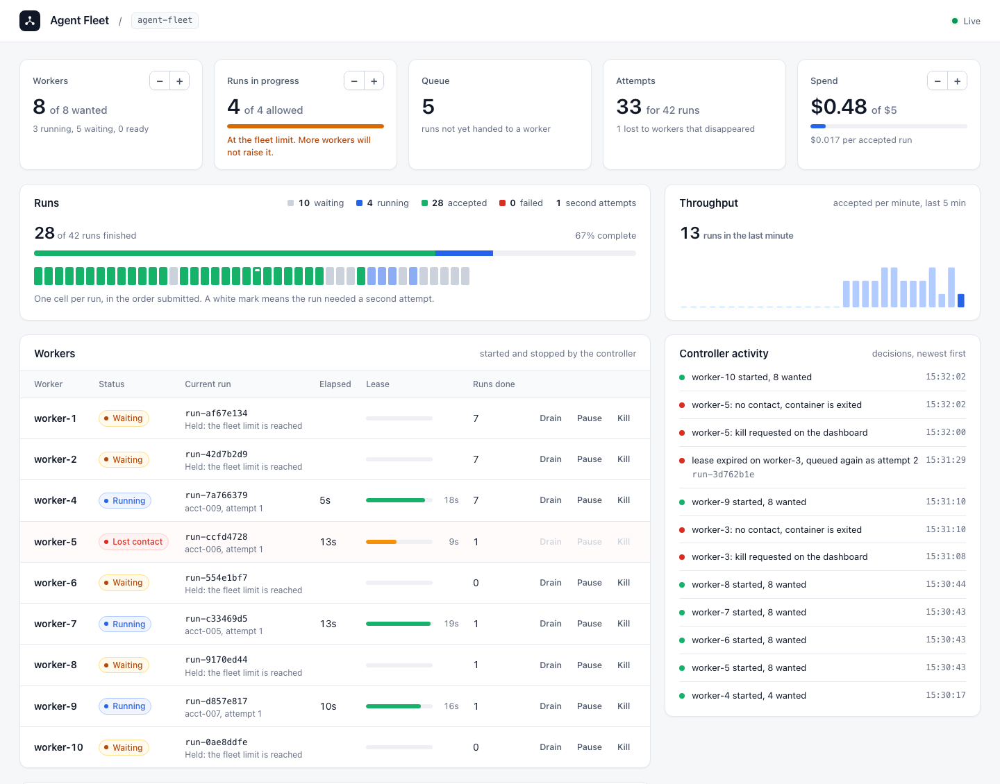

# Demo 2: Running a Fleet of Agents

Demo 1 had one worker draining a queue one run at a time. This demo runs a pool of
workers. A controller keeps the pool at the size you ask for, the queue spreads runs
across the workers, a fleet-wide limit caps how many runs are in progress no matter how
many workers exist, and when a worker disappears its run is finished by another one.
A dashboard shows all of it as it happens.



The task, the agent, and the completion check are the same as in Demo 1. `agent.py` is an
identical copy. What changed is everything around the run.

```text
submit.py ──> api ──> postgres    runs, attempts, events, workers, settings
               │
               └────> redis       queue: carries only the run ID
                        │
        worker-1 ... worker-N     each runs the agent in its own container
                        ▲
                   controller     starts and stops workers, recovers lost runs
                        ▲
                    dashboard     shows the fleet, writes targets and commands to postgres
```

## Setup

You need Docker Desktop, Python 3.12 or newer, and an Anthropic API key in `.env` at the
repository root, as in Demo 1. Eight busy workers need about 3 GB of memory in Docker.

A full walkthrough of about 55 runs costs about a dollar with Claude Haiku 4.5, at the 1.7
cents per run we measured in September 2026. The fleet also has a spend limit, 5 dollars by
default, and stops claiming runs when it is reached.

Start the fleet and open the dashboard:

```bash
cd demos/02_agent_fleet
docker compose up -d --build
open http://localhost:8080
```

## The walkthrough

**1. Watch the controller bring up two workers.** The Workers tile starts at "0 of 2 wanted"
and the table is empty. Within a few seconds two rows appear. Compose knows about five
services. The workers are not among them, because the controller starts them:

```bash
docker compose ps
docker ps --filter label=fleet.project=agent-fleet
```

**2. Submit 50 runs.**

```bash
python3 submit.py --count 50
```

The Runs panel fills with 50 cells, one per run in the order submitted. Two turn blue, 48
stay grey. In our validation runs each worker cleared between 3 and 4 runs a minute, so two
workers would need about seven minutes for this backlog.

**3. Scale to four.** Press **+** on the Workers tile until it says 4 wanted. Two more rows
appear and throughput doubles. The Throughput chart shows the step. The API and the queue
did not change.

**4. Scale to eight, and meet the fleet limit.** On the Runs in progress tile, press **−**
until it says 4 allowed, then set Workers to 8. Four workers run. The other four hold a run
and wait, the tile turns amber, and the Throughput chart stays flat. The tile says why:
more workers will not raise the limit. This stands in for a model allowance the whole
fleet shares. Raise the limit to 8 and all eight work. In our validation runs throughput
doubled each time the working fleet doubled, and eight workers cleared about 30 runs a
minute.

**5. Kill a busy worker.** Press **Kill** on a row that says Running. Its status turns to
"Lost contact" and its lease bar drains from green to amber to red, because nothing is
renewing it. When the lease runs out, the controller marks the attempt lost and queues the
run again. Meanwhile it has already started a replacement worker. The Controller activity
panel, and the controller's log, tell the story:

```text
[controller] worker_kill     worker-8: kill requested on the dashboard
[controller] worker_gone     worker-8: no contact, container is exited
[controller] worker_started  worker-9 started, 8 wanted
[controller] attempt_lost    lease expired on worker-8, queued again as attempt 2
```

Cells that needed a second attempt carry a small white mark in the Runs panel.

**6. Optional: pause a worker instead of killing it.** Press **Pause** on a busy worker.
To the fleet this looks the same as a crash: the lease runs out and another worker finishes
the run. Now press **Resume**. The paused worker wakes up, finishes its own copy of the
run, tries to record the result, and is refused:

```text
[worker-2] run-c8d8dd5f  result_refused this attempt lost its lease, so its result is discarded
```

Losing contact with a worker does not prove it stopped. The guarded update is what keeps a
late result from overwriting the accepted one.

**7. Scale down to two.** Idle workers leave at once. Busy workers drain: they finish
the run in hand, then leave, and the controller removes their containers.

**8. Read what happened.**

```bash
./tables.sh
./tables.sh run-c29a290d
```

The second form shows one run's attempts and events. This is a run whose first worker was
killed, from our validation run, with the agent's own steps left out:

```text
 number | worker_id |  status  | turns | cost_usd | seconds |     error
--------+-----------+----------+-------+----------+---------+---------------
      1 | worker-13 | lost     |       |          |      29 | lease expired
      2 | worker-19 | finished |     5 |   0.0152 |      14 |

    at    | attempt |   source   |      type      |                        summary
----------+---------+------------+----------------+-------------------------------------------------------
 01:02:21 |         | api        | submitted      |
 01:03:14 |       1 | worker-13  | claimed        | acct-002, attempt 1
 01:03:43 |       1 | controller | attempt_lost   | lease expired on worker-13, queued again as attempt 2
 01:04:54 |       2 | worker-19  | claimed        | acct-002, attempt 2
 01:05:08 |       2 | worker-19  | agent_finished | success, 5 turns, 34,683 tokens in, $0.015
 01:05:08 |       2 | worker-19  | accepted       | every figure matches the input
```

The lost attempt has no usage recorded. The model calls it made were real, and nobody
reported them. Cost per accepted run on the dashboard is therefore a floor.

**9. Optional: a run that cannot succeed.**

```bash
python3 submit.py acct-corrupt
```

That account's CSV lacks the `units` column. The worker refuses it before calling the
model, the run fails after one attempt, and it is not retried, because a retry cannot fix
the input. Its cell in the Runs panel turns red.

## Files to follow

| File | What to read for |
|---|---|
| `controller.py` | `reconcile`: six numbered steps, every two seconds. Observe, carry out operator commands, find workers that are gone, expire leases, fix the worker count, clean up. `plan_workers` decides what to start and what to drain |
| `worker.py` | Demo 1's steps, plus four additions: registering, `heartbeat` renewing the lease, `claim` checking the fleet's limits under one lock, and the guarded update in step 8 |
| `schema.sql` | New since Demo 1: leases on `attempts`, the `workers` and `settings` tables, a source on every event |
| `dashboard.py`, `dashboard.html` | The page and its one JSON route. They write targets and commands to Postgres and never touch Docker |
| `api.py`, `agent.py`, `submit.py`, `watch.py`, `tables.sh` | As in Demo 1. `agent.py` is identical. The API reports each run's latest attempt |
| `compose.yaml`, `Dockerfile` | One image for every service and every worker. Only the controller mounts the Docker socket |

Compare the two demo folders directly. `diff ../01_agent_worker/worker.py worker.py` shows
exactly what a worker needs once it is one of many.

## What to look for

- **The controller works from targets, not commands.** You change a number. It compares
  what exists with what is wanted and acts, every two seconds, including after it restarts.
- **A worker that is starting counts.** The controller does not start a second replacement
  while the first is still booting.
- **Workers and runs have separate lifetimes.** A worker takes run after run. A run can
  outlive the worker that started it.
- **The queue delivers, the run record owns.** A message only carries a run ID. The claim in
  Postgres decides who executes it, and the lease decides for how long.
- **A lease turns silence into a decision.** The worker renews every 5 seconds for 20. If it
  stops, the fleet knows within 20 seconds without having to reach the worker.
- **A retry is a new attempt of the same run.** The run ID stays. The attempt number, the
  worker, and the working directory change. Two attempts is the limit.
- **Stale results are refused.** The final update only succeeds while the attempt is still
  `running`. That one condition is what makes recovery safe.
- **Some limits belong to the fleet.** `max_active_runs` and `max_fleet_spend_usd` are checked
  inside the claim, under one lock, so eight workers cannot each take the last place.
- **More workers help until something shared is the limit.** Four workers at a limit of four
  and eight workers at a limit of four clear the same number of runs a minute.
- **Not every failure deserves a retry.** A lost worker is retried. An input the task cannot
  use fails once.
- **Scale-down drains.** Idle workers go first, and a busy worker finishes its run.

## The execution boundary

As in Demo 1, each worker's container is its sandbox, with the same caveats: the agent's
shell shares that worker's environment, network, and filesystem. A fleet adds one more
thing to be exact about. The controller mounts the Docker socket, which is equivalent to
root on the host. It is the only service that does, and no worker or agent can reach it.
A production fleet would ask a scheduler or a sandbox service for capacity instead.

## Cleanup

```bash
docker compose down -v
```

The controller removes its workers as it shuts down, so nothing is left behind.

## Troubleshooting

- **No workers appear**: read `docker compose logs controller`. The controller needs the
  Docker socket at `/var/run/docker.sock`.
- **Workers wait and nothing runs**: check the two limits on the dashboard. At the spend
  limit, no worker can claim a run until you raise it.
- **You changed the code and nothing changed**: rebuild everything with
  `docker compose up -d --build`. Every service shares the image the `api` service builds.
  Restarting the controller restarts the workers, and the runs they held are recovered.
- **`docker compose down` says the network is in use**: a worker outlived the controller.
  Remove them with `docker rm -f $(docker ps -aq --filter label=fleet.project=agent-fleet)`.
- **Ports 8000 or 8080 are taken**: set `API_PORT` or `DASHBOARD_PORT` before starting, and
  `API_URL` for the clients.
